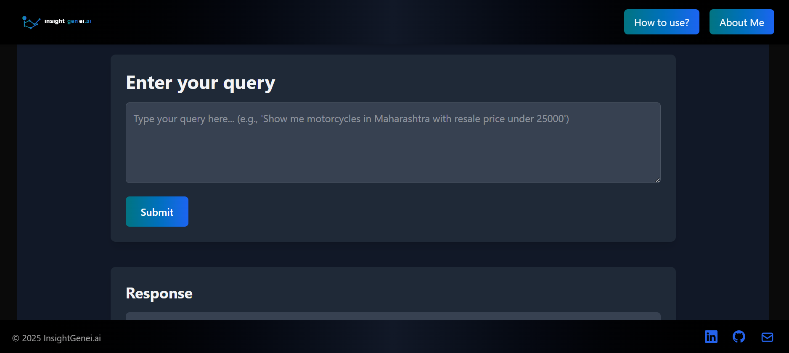

# 🏍️ InsightGenei.ai(https://insightgenei-ai.vercel.app/)

**Transform your thoughts into insights with natural language!**



---


## ✨ Intro

**InsightGenei.ai** is a cutting-edge full-stack application that revolutionizes how users interact with data. Speak to your database in plain English and get beautiful, insightful results instantly!

This intelligent system processes natural language queries about Indian motorcycle sales data, translates them into precise SQL commands, and delivers both raw data and AI-generated insights.

---

## 🏗️ Architecture

InsightGenEI.ai uses a modern three-tier architecture:

- 🎨 **Frontend**: Sleek React application hosted on **Vercel**
- ⚙️ **Backend**: Powerful FastAPI app hosted on **Render**
- 🗄️ **Database**: Lightning-fast PostgreSQL hosted on **Railway**

---

## 🚀 Key Features

- 💬 **Natural Language Processing** – Ask questions like you're talking to a human
- 🧠 **AI-Powered SQL Translation** – Converts queries to database calls
- 📊 **Smart Visualizations** – Clean, responsive tables
- 🔮 **AI-Generated Summaries** – Understand what your data means in plain English
- ⚡ **Lightning Fast** – Results in seconds
- 📱 **Fully Responsive** – Mobile-friendly experience

---

## 📋 Data Schema

| Field                 | Description                                        |
|----------------------|----------------------------------------------------|
| 🗺️ `State`            | Indian state the motorcycle is from               |
| 🛣️ `Avg Daily Distance` | Daily travel distance in km                     |
| 🏭 `Brand`            | Manufacturer of the motorcycle                    |
| 🔤 `Model`            | Specific model name                               |
| 💰 `Price (INR)`      | Original cost in Indian Rupees                    |
| 📅 `Year of Manufacture` | Manufacturing year                             |
| 🔧 `Engine Capacity (cc)` | Engine power in cc                            |
| ⛽ `Fuel Type`        | Petrol, diesel, or electric                        |
| 🛢️ `Mileage (km/l)`   | Fuel efficiency                                   |
| 👤 `Owner Type`       | First, second, or third owner                     |
| 📝 `Registration Year` | When it was officially registered                |
| 🛡️ `Insurance Status` | Current insurance coverage                        |
| 🏪 `Seller Type`      | Individual or dealership                          |
| 💸 `Resale Price (INR)` | Current market value                            |
| 🏙️ `City Tier`        | 1 = Metro, 2 = Semi-Urban, 3 = Rural              |

---

## 🛠️ Technologies Used

### 🌈 Frontend Magic

- **React.js** – Responsive and dynamic UI
- **Framer Motion** – Smooth animations
- **Tailwind CSS** – Utility-first styling

### 🧙‍♂️ Backend Wizardry

- **FastAPI** – High-performance backend
- **LangChain** – AI pipeline orchestration
- **Groq API** – Using **Llama 3.3** and **DeepSeek** models
- **psycopg2** – PostgreSQL database connector

### 🏛️ Database

- **PostgreSQL** – Robust, scalable SQL database

### ⚔️ Deployment Arsenal

- **Vercel** – Frontend hosting with edge network
- **Render** – Scalable backend hosting
- **Railway** – Managed PostgreSQL provisioning

---

## 💡 Example Queries

Try these on the live site:

- 🏍️ `"Show me motorcycles in Maharashtra with resale price under 25000"`
- 💰 `"What's the average resale price for Royal Enfield motorcycles?"`
- ⚡ `"List all electric vehicles sorted by mileage"`
- 🏆 `"Which brand has the highest average resale value?"`
- 📝 `"Show motorcycles manufactured after 2020 with active insurance"`
- 🧮 `"Calculate the depreciation percentage for KTM bikes"`

---

## 🧪 Local Development Quickstart

### 🔧 Prerequisites

- Node.js and npm
- Python 3.8+
- PostgreSQL database

---

### 🔥 Backend Setup

```bash
# Clone the repository and navigate to backend
cd backend

# Create a virtual environment
python -m venv venv
source venv/bin/activate  # On Windows: venv\Scripts\activate

# Install dependencies
pip install -r requirements.txt

# Create .env file and set variables
DATABASE_URL=your_postgresql_connection_string
GROQ_API_KEY=your_groq_api_key

# Run the server
uvicorn app.main:app --reload
```

---

### ✨ Frontend Setup

```bash
# Navigate to frontend
cd frontend

# Install dependencies
npm install

# Start the development server
npm run dev
```

---

## 🔄 How It Works


1. User enters a natural language question  
2. Our AI translates it to precise SQL  
3. The query runs against our motorcycle database  
4. Raw results are captured and processed  
5. A second AI layer generates summaries  
6. Beautiful results appear on screen  

---

## 👨‍💻 From the Creator

InsightGenEI.ai is my solo project, born from a passion for making data accessible to everyone. I combined my expertise in full-stack development, AI, and database design to create a tool that **breaks down the barriers between people and data**.

---

## 📬 Contact Me
Feel free to reach out for collaborations, questions, or feedback!

- 📧 Email: [roshankumarsingh.dev@gmail.com](mailto:roshankumarsingh.dev@gmail.com)  
- 🔗 Portfolio: [roshankumarsingh.vercel.app](https://roshankumarsingh.vercel.app)  
- 💼 LinkedIn: [linkedin.com/in/roshankumarsingh-19b662244](https://www.linkedin.com/in/roshankumarsingh-19b662244)  


> 🌟 Ready to explore the data? [Try InsightGenEI.ai now!](https://insightgenei-ai.vercel.app/) 